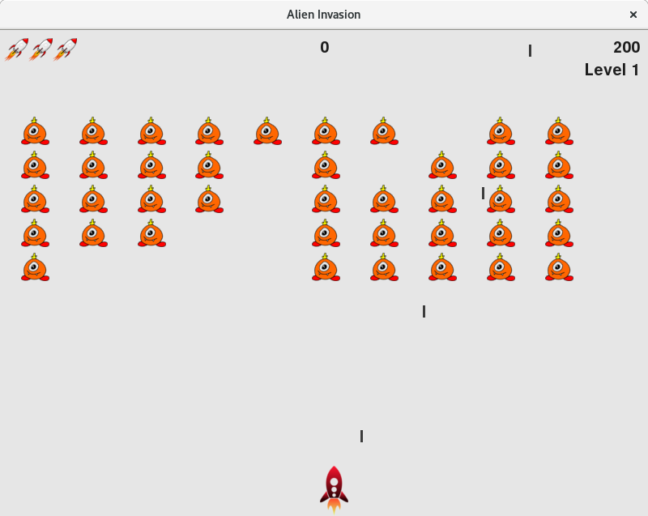

# python-rampup

Just few example scripts to start using Python.
I followed the book "Python crash course" by Eric Matthes and it was preety good to quickly learn the syntax.
The game is based on Project 1 (Space invasion) and then it was further extended. My record is 10890.

Using Python 2.7.13

